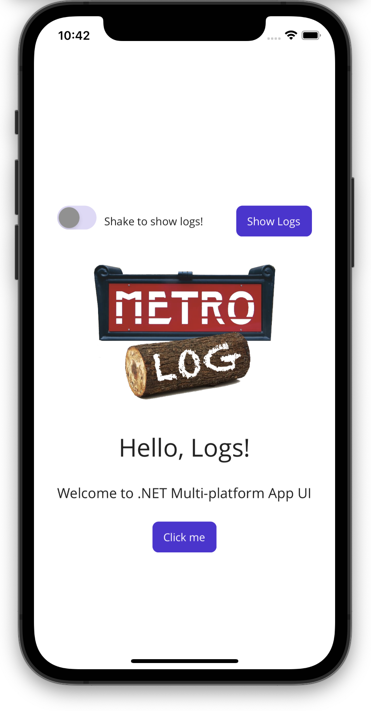
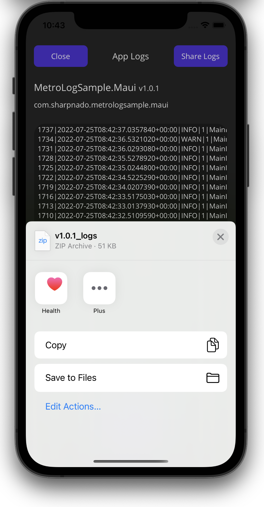

| Platform        | Logo               | Package                                                                                                                          |
|-----------------|--------------------|----------------------------------------------------------------------------------------------------------------------------------|
| `MetroLog.Net6` |       | [](https://www.nuget.org/packages/Sharpnado.CollectionView) |
| `MetroLog.Maui` |  | [](https://www.nuget.org/packages/Sharpnado.CollectionView) |


# Overview

MetroLog.Net6 is a .NET 6 lightweight logging framework designed primarily for mobile platforms like `iOS` and `Android`.

The intention is that MetroLog is mostly compatible with `NLog`. Both the surface area and internal construction
should just about match.

However, to achieve better startup performance, configuration is only possible through code.

# Configuration

Configuration is made through the crossing of a **target** and **log levels**.

A target specify how the logs will be stored. For example, you can use the `DebugTarget` to show your logs in the debug output.
Or you could use the `FileSnapshotTarget` to store your logs in a file.

The log levels describe the level of criticality. You bind each target to a set of log levels.

## Standard configuration

```csharp
    var config = new LoggingConfiguration();

#if RELEASE
    config.AddTarget(
        LogLevel.Info, 
        LogLevel.Fatal, 
        new StreamingFileTarget(retainDays: 2);
#else
    config.AddTarget(
        LogLevel.Debug, 
        LogLevel.Fatal, 
        new DebugTarget());
#endif

    config.AddTarget(
        LogLevel.Info, 
        LogLevel.Fatal, 
        new MemoryTarget(2048);

    LoggerFactory.Initialize(config);
```

If we are in release mode, we store our logs in files for 2 days, only if it falls between `Info`and `Fatal` levels (debug level logs will be discarded).

If we are in debug we just send our logs to the debug output.

In both case, we send our logs to a memory buffer so we can display them at any time (through the `LogOperator`).


### Usage

```csharp
public class DownloadService 
{
    private static readonly ILogger Log = LoggerFactory.GetLogger(nameof(DownloadService));
    
    public async Task<File> DowloadAsync()
    {
        Log.Info("DowloadAsync()");
        
        try 
        {
            await _client.GetAsync();
        }
        catch (Exception exception) 
        {
            Log.Error("Oops something bad happened", exception);
        }
    }
}

```

## Microsoft extensions configuration

```csharp
builder.Logging
    .AddDebugLogger(_ => {})
    .AddInMemoryLogger(
        options =>
        {
            options.MaxLines = 1024;
            options.MinLevel = LogLevel.Debug;
            options.MaxLevel = LogLevel.Critical;
        })
    .AddStreamingFileLogger(
        options =>
        {
            options.RetainDays = 2;
            options.FolderPath = Path.Combine(
                FileSystem.CacheDirectory,
                "MetroLogs");
        });
```

In this cas we add 3 different targets to our configuration:
* Debug target (`Info -> Critical`)
* In memory target (`Debug -> Critical`)
* File target (`Info -> Critical`)

### Usage

```csharp
public class DownloadService 
{
    private readonly ILogger _logger;
    
    public DowloadService(ILogger<DownloadService> logger)
    
    public async Task<File> DowloadAsync()
    {
        _logger.Info("DowloadAsync()");
        
        try 
        {
            await _client.GetAsync();
        }
        catch (Exception exception) 
        {
            _logger.Error("Oops something bad happened", exception);
        }
    }
}

```

We only specify the levels for the in memory logger, it means the other loggers will have the default min/max levels.

Default min level is `Info`, default max level is `Fatal`.

## List of targets

* `ConsoleTarget`: log to `Console.WriteLine`
* `TraceTarget`: log to `Trace.WriteLine`
* `DebugTarget`: log to debug output
* `JsonPostTarget`: post your log message to a http endpoint
* `MemoryTarget`: log to a in-memory buffer
* `StreamingFileTarget`: log a to file

## Extensibility

You can of course provide your own `Target` by implementing `SyncTarget` or `AsyncTarget`.

You can even subclass `FileTarget` if you want your own file base target.

Those target can also provide additional features through the subclassing of the `ILogOperator` interface.

# Additional features: LogOperator.Instance

Some targets provide additional features.\
For example the `FileStreamingTarget` allows us to get the logs file as a compressed zip.\
Accessing those capabilities is made possible by the `LogOperator.Instance` singleton.

If your configuration has a file target, you can then retrieve your compressed logs through the log operator:

```csharp
    private void InitializeAppCenter()
    {
#if RELEASE
        if (!LogOperatorRetriever.Instance.TryGetOperator<ILogCompressor>(out var logCompressor))
        {
            return;
        }
        
        Crashes.GetErrorAttachments = report =>
        {   
            var compressedLogs = logCompressor.GetCompressedLogs();

            return new[]
            {
                ErrorAttachmentLog.AttachmentWithBinary(
                    compressedLogs.ToArray(),
                    "logs.zip",
                    "application/x-zip-compressed"),
            };
        };
#endif
    }
```

## List of log operators

### MemoryTarget provides GetLogList

````csharp
public interface ILogLister : ILogOperator
{
    Task<List<string>> GetLogList();
}
````

### StreamingFileTarget provides GetCompressedLogs

````csharp
public interface ILogCompressor : ILogOperator
{
    Task<MemoryStream> GetCompressedLogs();
}
````

# MetroLog.Maui

MetroLog provides a MAUI helper package adding features like:

* Share logs as a zip file
* Displaying logs in a page
* Shake the device to display logs



You can find all the information needed in the `MetroLogSample.Maui` project.

## Maui configuration

```csharp
public static class MauiProgram
{
    public static MauiApp CreateMauiApp()
    {
        var builder = MauiApp.CreateBuilder();
        builder.UseMauiApp<App>()
            .ConfigureFonts(
                fonts =>
                {
                    fonts.AddFont("OpenSans-Regular.ttf", "OpenSansRegular");
                    fonts.AddFont("OpenSans-Semibold.ttf", "OpenSansSemibold");
                });

        builder.Logging
            .AddDebugLogger(_ => {})
            .AddInMemoryLogger(
                options =>
                {
                    options.MaxLines = 1024;
                    options.MinLevel = LogLevel.Debug;
                    options.MaxLevel = LogLevel.Critical;
                })
            .AddStreamingFileLogger(
                options =>
                {
                    options.RetainDays = 2;
                    options.FolderPath = Path.Combine(
                        FileSystem.CacheDirectory,
                        "MetroLogs");
                });

        builder.Services.AddSingleton(LogOperatorRetriever.Instance);
        builder.Services.AddSingleton<MainPage>();

        return builder.Build();
    }
}
```

## LogController

The package provides a LogController that acts like a view model providing commands and service to a view.

````csharp
public class LogController : INotifyPropertyChanged
{
    public ICommand ToggleShakeCommand { get; }

    public ICommand GoToLogsPageCommand { get; }

    public ICommand ClosePageCommand { get; }

    public bool CanGetCompressedLogs => LogCompressor != null;

    public bool CanGetLogsString => LogLister != null;

    public bool IsShakeEnabled
    {
        get => _isShakeEnabled;
        set
        {
            if (_isShakeEnabled != value)
            {
                ToggleAccelerometer(value);
                _isShakeEnabled = value;
            }

            OnPropertyChanged();
        }
    }

    public static void SuspendShake();

    public static void ResumeShakeIfNeeded();

    public async Task<MemoryStream?> GetCompressedLogs();

    public async Task<List<string>?> GetLogList();
}
````

By setting `IsShakeEnabled` to true, you can display your log page by simply shaking your device.


### Initialization

Because there is so several navigation framework out there, you first need to initialize the `LogController` with the navigation function, and the pop page function.

````csharp
using MetroLog.Maui;

namespace MetroLogSample.Maui;

public partial class App : Application
{
    public App(MainPage mainPage)
    {
        InitializeComponent();

        MainPage = new NavigationPage(mainPage);

        LogController.InitializeNavigation(
            page => MainPage!.Navigation.PushModalAsync(page),
            () => MainPage!.Navigation.PopModalAsync());
    }
}
````

The third parameter is the page factory returning the log page you want to display when are calling the `GoToLogsPageCommand`.

By default, it's the `MetroLogPage`.

## MetroLogPage

The package provides a default log page bound to the `LogController`.

This page displays the logs, and give the possibility to share your logs as a zip and refresh them.




**WARNING**

* you need to add the `MemoryTarget` if you want to display the logs.
* you need to add the `StreamingFileTarget` if you want to share the logs.

### Customization

You can customize some page colors by settings those resource key to the desired color:

````csharp
public static class LogPageResources
{
    public const string LogPageBackgroundColor = nameof(LogPageBackgroundColor);
    public const string LogPageTextColor = nameof(LogPageTextColor);
    public const string LogPageButtonColor = nameof(LogPageButtonColor);
    public const string LogPageFontFamily = nameof(LogPageFontFamily);
    public const string LogPageLogsBorderColor = nameof(LogPageLogsBorderColor);
    public const string LogPageLogsBackgroundColor = nameof(LogPageLogsBackgroundColor);
}
````

```xml
<?xml version="1.0" encoding="UTF-8"?>

<Application xmlns="http://schemas.microsoft.com/dotnet/2021/maui"
             xmlns:x="http://schemas.microsoft.com/winfx/2009/xaml"
             x:Class="MetroLogSample.Maui.App">
    <Application.Resources>
        <ResourceDictionary>
            <ResourceDictionary.MergedDictionaries>
                <ResourceDictionary>
                    <Color x:Key="LogPageBackgroundColor">#262626</Color>
                    <Color x:Key="LogPageLogsBackgroundColor">#1D1D1D</Color>
                    <Color x:Key="LogPageLogsBorderColor">#1D1D1D</Color>
                    <Color x:Key="LogPageTextColor">White</Color>
                </ResourceDictionary>
                <ResourceDictionary Source="Resources/Styles/Colors.xaml" />
                <ResourceDictionary Source="Resources/Styles/Styles.xaml" />
            </ResourceDictionary.MergedDictionaries>
        </ResourceDictionary>
    </Application.Resources>
</Application>

```

# Meta

This is a fork/reboot of the MetroLog library created by Claire Novotny.

This is an open source project that welcomes contributions/suggestions/bug reports from those who use it.
If you have any ideas on how to improve the library, please contact [@piskariov](https://twitter.com/piskariov).

MetroLog is distributed under the MIT license.
